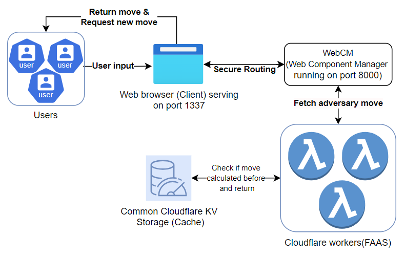
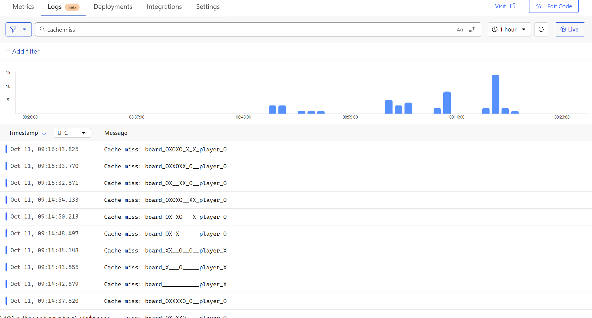

# cloudflare_assessment

# Cloudflare Assignment Architecture

### App Architecture



### Key Features:
- Choice of X or O for the player.


- Real-time interaction on a 3x3 grid.
- AI adversary powered by a minimax algorithm served from a deployed Cloudflare Worker (with low latency responses).
- Secure communication between the browser and the backend.
- Clear indicator for the next turn and declaration of a winner or a draw using a modal.

***After Adversary has made move as O and is waiting for player input***:


***Sample of Adversary winning***:


***Sample of draw***:


Sadly, with min max algorithm, I could never win to get a screenshot of myself winning. Real challenge :)

- Communication Between the Widget and Worker: Cloudflare’s manager.route and manager.fetch APIs are used to ensure seamless communication between the Managed Component and the Cloudflare Worker. These are first-party requests, ensuring better security and performance.

### Design Considerations:
- Use of Cloudflare Workers:
    - Being able to hide logic behind moves behind cloudflare worker instead of exposing it in javascript on frontend. Instead a serverside component is used in the form of cloudflare worker to hid this logic and prevent reverse engineering of moves by users.
        - [x] Random Move Logic: In initial phase, the worker generated a random available move for the AI.
        - [x] Minimax Algorithm: In later phases, to make the game more challenging, the worker uses the Minimax algorithm to choose the optimal move based on the current state of the board.
    - Function as a Service (FAAS) that also has the advantage of being served on edge with cloudflare's powerful backbone architecture so that response will be faster based on location of users
        - Scaling, security, rate limiting are well managed by cloudflare infrastructure with the option of monitoring worker usage, reducing workload for the project substantially.
- Using wrangler client to effectively develop cloudflare worker that can securely interact with frontend and simulates well locally. After deploying on cloud, with a simple change in URL, it seamlessly integrates with the rest of the project.
- Sensitive information like API keys, database credentials, or tokens might be exposed. With the use of wrangler cli and an active account, this reduces the risk of having to place api keys in own code repository and reduced safety risk as api key is only required during publishing of cloudflare worker using wrangler cli.

## Tech Stack
- webcm
- managed-components
- tailwind (for styling)
- Cloudflare worker
- KV Storage for caching
- K6 for load testing

## Running locally

1. Use deployed cloud worker at https://workeradv.maaruni505.workers.dev and place as workeradv_url variable in a .env file or run cloud worker locally with:
```
cd workerAdv
npm i
npm start
```
Place http://127.0.0.1:8787 as workeradv_url in .env file. 

2. Run this command from main directory to start serving website
```
npm run dev
``` 

## Measuring performance with k6

1. Ensure k6 is installed in your computer with this guide ().

2. Run these commands to run test on local http://localhost:8787/move endpoint:
```
cd loadtest
npm i && k6 run test.js
```

### Performance of deployed Cloudflare worker (Caching vs No Caching layer)


Key Improvements:
- Avg Request Duration: Improved from 75.87ms to 28.81ms.
- HTTP Request Blocked: Improved from 2.57ms to 799.68µs.
- Total Requests: Increased from 5031 to 5274.

## Viewing Logs:
All logs for deployed Cloudflare worker:


Filtered Cache hit logs:


Filtered Cache miss logs:



## To Dos:
- [x] Create tic tac toe frontend using HTML strings (MC usage)
- [x] Create javascript as string for user interactions (MC usage)
- [x] Create and deploy cloudflare worker to return moves:
    - [x] random moves
    - [x] min max algorithm for smarter moves
- [x] Load testing with k6 to find performance locally and deployed version
- [x] Find bottlenecks and ways to improve speed of response with cloudflare native existing solutions
    - [x] Caching
    - [x] Logging to get cache hits and misses

References:
- Post request to cloudflare worker: https://developers.cloudflare.com/workers/examples/post-json/


# Initial Instructions

### Cloudflare Zaraz Technical Assignment

## Description

We've provided a basic example of a widget in `index.ts`. Starting from this project layout, create a player-vs-computer [tic-tac-toe](https://en.wikipedia.org/wiki/Tic-tac-toe) [widget](https://managedcomponents.dev/specs/embed-and-widgets/widgets) using [Managed Components](https://managedcomponents.dev/).

## Key features:

- The player should be able to select whether they are playing as X or O
- Clicking a cell on the 3x3 grid should result in a X or O depending on which the player has selected
- There should be a clear indicator of who’s turn is next after each move is made
- If the game grid is filled without a winner then a draw should be declared
- If there’s a winning line of 3 the winner should be declared 
- The computer adversary can play randomly 

## Implementation details:

### Core success criteria

- All static assets required for the games should be provided entirely by the Managed Component (MC) with no dependent html from the site where it’s included
- Each position where the computer adversary plays next should be retrieved from a [Cloudflare worker](https://developers.cloudflare.com/workers/) of your creation, separate to that of the MC widget
- [`manager.route`](https://managedcomponents.dev/specs/server-functionality/route) and [`manager.fetch`](https://managedcomponents.dev/specs/server-functionality/fetch) should be used to ensure that all requests between the browser and the widget are first-party
- Clearing the grid and restarting the game

### How to run the project

- `npm run dev` to start the development server

## Deliverables

- a link to the git repository containing your MC and worker code
- users of your MC (via a site proxied by Webcm) should be able to complete a game of tic tac toe using the mouse, against an artificial adversary, with a declared winner when the game is over

**Everything that was not mentioned above is optional.**